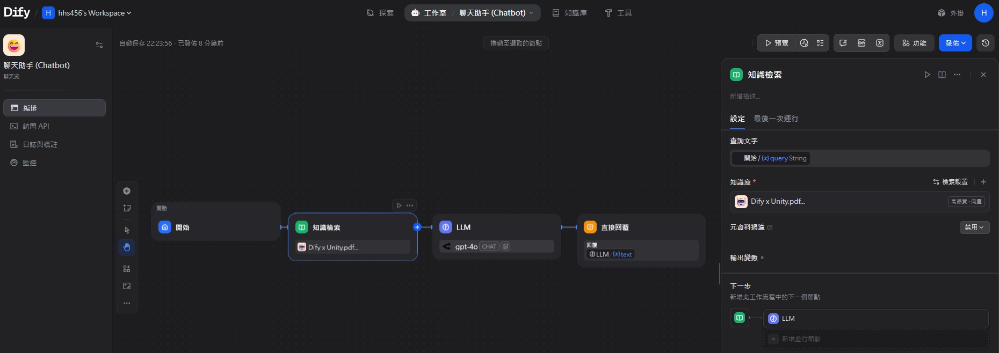
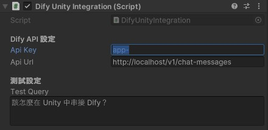
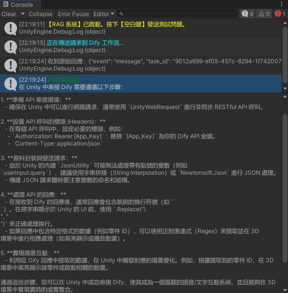

# AR-Chat-Bot-Prototype

這是一個將 **Dify (LLM 應用開發平台)** 與 **Unity (遊戲引擎)** 初步整合的實作專案。透過 RAG (檢索增強生成) 技術，讓 Unity 內的虛擬助理能讀懂 PDF 技術手冊，透過藉由 Unity 實現跨平台能力在未來發布為 Mobile AR。

## 🚀 專案亮點

* **在地化 AI 大腦**：基於 Docker 部署 Dify，確保企業級技術文檔數據不外流，隱私有保障。
* **智慧知識庫 (RAG)**：針對複雜技術手冊進行向量化處理，支援語義檢索，解決傳統關鍵字搜尋精準度不足的問題。
* **模型靈活性**：透過 OpenRouter 接入 Claude 3.5 Sonnet、GPT-4o 或 Llama 3 等多種模型，可根據成本與需求隨時切換。

## 🛠 技術架構

* **後端系統**: Dify (Self-hosted via Docker Compose)
* **模型入口**: OpenRouter (API 轉接層)
* **前端引擎**: Unity 2022.3+ (URP/HDRP 支援)
* **輸入系統**: Unity New Input System Package

## 📦 快速開始與配置

### 1. 啟動 Dify 後端環境

確保你的環境已安裝 Docker Desktop 並開啟 WSL 2 引擎：

    # 進入專案的 docker 目錄
    cd dify/docker

    # 複製環境變數設定
    cp .env.example .env

    # 啟動所有容器
    docker compose up -d

啟動後，瀏覽器訪問 http://localhost 進行管理員註冊。

### 2. Dify 工作流 (Chatflow) 配置

為了確保 Unity 腳本能正確抓取資料，請在 Dify 的工作流畫布中進行以下設定：

* **開始節點**：新增輸入欄位 userinput.query (型別為 String)。
* **知識檢索節點**：上傳 PDF 手冊，並將「查詢變數」指向 {{#start.userinput.query#}}。
* **LLM 節點**：將「知識檢索」的輸出結果關聯至 Context 上下文。
* **發布**：務必點擊右上角的「發布」按鈕，否則 API 變動不會生效。

### 3. Unity Client 設定

1. 將 DifyWorkflowClient.cs 匯入專案。
2. 在場景中建立一個名為 DifyManager 的空物件並掛載該腳本。
3. 在 Inspector 面板中：
   * ApiKey: 填入 Dify 應用的 app- 開頭金鑰。
   * ApiUrl: 設定為 http://localhost/v1/chat-messages。
4. 按下 Play 鍵並點擊螢幕，按 [空白鍵] 即可發送測試問題。

## 🖥 核心代碼邏輯 (JSON 處理)

本專案解決了 Unity 內建 JsonUtility 無法直接序列化帶有點號 Key（如 userinput.query）的限制：

    // 採用字串拼接確保 JSON 結構符合 Dify 工作流規範
    string json = "{" +
        "\"inputs\": { \"userinput.query\": \"" + escapedQuery + "\" }," +
        "\"query\": \"" + escapedQuery + "\"," +
        "\"response_mode\": \"blocking\"," +
        "\"user\": \"unity_dev_tester\"" +
    "}";

## 💻 成果展示 (Unity Console)

## 🤖 AI 輔助開發聲明

本專案在程式碼撰寫、架構設計與文件整理的過程中，有使用 AI 工具（如 Google Gemini / ChatGPT）作為輔助。所有生成的程式碼及邏輯皆已由開發者進行人工審查、測試與實際驗證，確保在 Unity 與 Dify 環境中能正常運行。

## ⚖️ 授權條款 (License)

本專案採用 **MIT License** 授權。您可以自由使用於個人或商業專案，詳情請參閱 LICENSE 檔案。

---
最後更新日期：2026-04-13